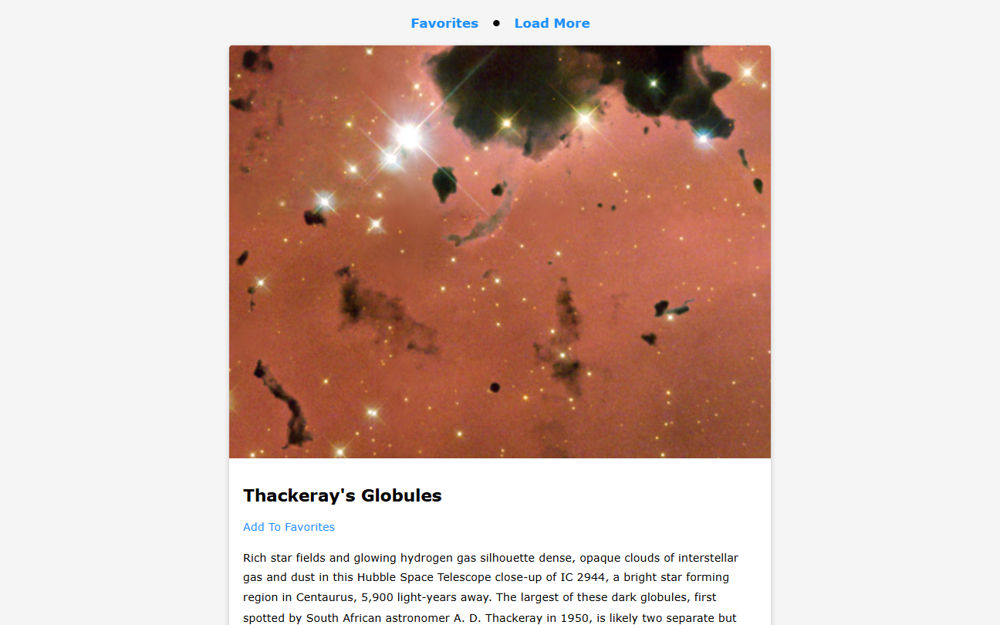

# NASA APOD | ZTM JS Web Projects Course

**Project 14/20**

🪐 NASA APOD (Astronomy Picture of the Day) is a web app that fetches breathtaking space imagery directly from NASA's open API. Users can explore the latest pictures of the cosmos, view detailed explanations, and save their favorite images locally using localStorage. All built with a clean, scrollable UI and optimized performance.

---

## 📚 Table of Contents

- [🔎 Overview](#-overview)
  - [📸 Screenshot](#-screenshot)
  - [🔗 Links](#-links)
  - [📌 Features](#-features)
- [🧠 My process](#-my-process)
  - [🛠️ Built with](#️-built-with)
  - [🎓 What I learned](#-what-i-learned)
  - [🔙 Previous Project](#-previous-project)
  - [🔜 Next Project](#-next-project)
  - [🗃️ Useful resources](#️-useful-resources)
- [👤 Author](#-author)
  - [🌐 Connect with Me](#-connect-with-me)
  - [💻 Coding Profiles](#-coding-profiles)

---

## 🔎 Overview

### 📸 Screenshot

### 🔗 Links

 - [🔴 Live Demo](https://dalascript.github.io/nasa-apod/)
 - [🗂️ GitHub Repository](https://github.com/DalaScript/nasa-apod)

### 📌 Features

 - ✅ Fetches 10 random images from NASA’s APOD API
 - ✅ Lazy-loaded, high-resolution imagery with smooth UI
 - ✅ Displays title, explanation, date, and copyright
 - ✅ Save images as favorites using localStorage
 - ✅ Switch between “Results” and “Favorites” views
 - ✅ Responsive layout for desktop and mobile devices
 - ✅ Loading screen and save confirmation popup
 - ✅ Clean card-based layout with modern styling

---

## 🧠 My Process

### 🛠️ Built with

 - HTML5
 - CSS3
 - Vanilla JavaScript
 - localStorage
 - NASA Open API – [APOD](https://api.nasa.gov/)

### 🎓 What I Learned

 - How to work with third-party APIs and handle dynamic data
 - Async JavaScript with `fetch()` and `async/await`
 - DOM manipulation to dynamically generate UI elements
 - Using `localStorage` to store and retrieve user data
 - Structuring reusable UI components with JS
 - Creating a clean, responsive layout with mobile support
 - Building user-friendly feedback with loaders and save confirmation

  > 🚀 For me, this project was more about **practice** and gaining additional **experience**,  
  > rather than learning something entirely new.  
  >  
  > 👨‍💻 Since I’m not a beginner and already familiar with these technologies,  
  > I approached it with confidence — and still, I truly **enjoyed working on it**.  
  >  
  > 🎯 Overall, I consider this a very **valuable and enjoyable experience**.

### 🔙 Previous Project

 - Spock Rock Game | *[Project 13/20]* → [View Repository](https://github.com/DalaScript/spock-rock-game)

### 🔜 Next Project

 - Math Sprint Game | *[Project 15/20]* → [View Repository](https://github.com/DalaScript/math-sprint-game)

### 🗃️ Useful resources

 - [Loaf](https://getloaf.io/) - Free Loaders
 - [NASA API Demo](https://api.nasa.gov/planetary/apod?api_key=DEMO_KEY)
 - [NASA API Documentation](https://api.nasa.gov/)
 - [W3Schools - Includes()](https://www.w3schools.com/jsref/jsref_includes.asp)
 - [W3Schools - JSON.stringify() method](https://www.w3schools.com/js/js_json_stringify.asp)
 - [W3Schools - JSON Parse](https://www.w3schools.com/js/js_json_parse.asp)
 - [Mozilla - Object.Values](https://developer.mozilla.org/en-US/docs/Web/JavaScript/Reference/Global_Objects/Object/values)
 - [Mozilla - Delete Operator](https://developer.mozilla.org/en-US/docs/Web/JavaScript/Reference/Operators/delete)
 - [MDN - window.scrollTo() documentation](https://developer.mozilla.org/en-US/docs/Web/API/Window/scrollTo)

---

## 👤 Author

### 🌐 Connect with Me

 - [Instagram](https://www.instagram.com/DalaScript)
 - [YouTube](https://www.youtube.com/@DalaScript)

### 💻 Coding Profiles

 - [freeCodeCamp](https://www.freecodecamp.org/DalaScript)
 - [FrontendMentor](https://www.frontendmentor.io/profile/DalaScript)
 - [GitHub](https://github.com/DalaScript)

*🙌 Thanks for checking out my project! More coming soon. Stay tuned 🚀*